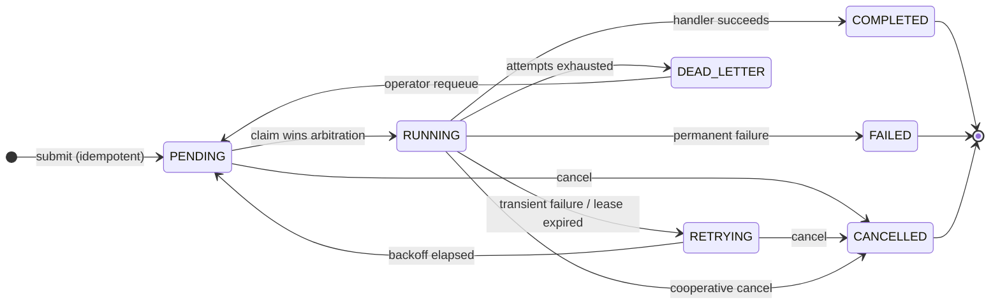

<div align="center">


###

<a href="bench/BENCHMARKS.md"></a>

###

<a href="https://www.linkedin.com/in/jvasquezcs" target="_blank"></a> <a href="mailto:jfvasq1@gmail.com"></a> <a href="https://github.com/jguapp" target="_blank"></a> <a href="https://calendly.com/jfvasq1/30min" target="_blank"></a>

###

**A job platform that assumes the worker dies.**

No backfill script. No "check the logs on Monday." Send `kill -9` to a worker in the middle of a job and the work still lands, on another machine, with the whole story written down.


</div>

###

<div align="center">

## The work that shouldn't happen on a request

</div>

Every app collects it. Article extraction that takes fifteen seconds. Embeddings that eat CPU. A webhook that needs five tries. A feed that wants polling on a schedule.

The usual first answers all fail the same way. Do it during the request and the user pays for it with a spinner. Fire off a goroutine and a restart quietly eats the work, with a human remembering a backfill script as the recovery plan. Use a queue with no record and "what happened to job 4821 yesterday" has no answer at all.

The worst one is subtler. A queue that trusts its workers will let the first `kill -9` strand a job in `RUNNING` forever, and nothing alerts, because nothing failed. A status just stops changing.

Calligraphy is the tier that handles it. **Redis Streams move the work, Postgres records the truth, and Go runs it**, with every seam between the three built around one question: and what if it dies right here?

###

<div align="center">

## Kill the worker. The job still lands.

</div>

Every claim is held by a lease that expires unless it is renewed. A worker that dies stops renewing, the reaper reclaims its jobs off the consumer group's own idle clock, and another worker runs them. A worker that was only stalled and wakes up later finds its late write bounced off a fencing token. The job may run twice. Exactly one result is ever recorded.

This is not a diagram promise. The integration suite starts a real worker process, waits until it is provably mid-job, sends it `SIGKILL`, and asserts the job finishes elsewhere with the whole history legible:

```
attempt 1   lease_expired   doomed-worker    "lease expired: worker presumed dead"
attempt 2   completed       healthy-worker
```

That test runs in CI on every push.

###

<div align="center">

## Every illegal move is a tested error

</div>



Seven states, eleven legal edges, and all 49 pairs are table-tested, the illegal ones as thoroughly as the legal ones. The database enforces the same rules a second time. Every transition is a conditional `UPDATE`, and zero rows affected means someone else got there first, which is a return value here rather than an error.

###

<div align="center">

## Backlog cannot hide inside a process

</div>

The worker pool works out `free = target − active` before every fetch and never claims more than that. There is no internal buffer channel, so a backlog has nowhere to pile up inside a process. It stays in Redis where it is visible as queue depth, durable across a restart, and claimable by whoever has capacity. The concurrency bound and the backpressure story are the same forty lines of Go.

###

<div align="center">

## Retries that don't stampede

</div>

Backoff is full jitter, `uniform(0, min(cap, base·2ⁿ))`, so five hundred jobs failing against one downed dependency come back decorrelated instead of in synchronised waves. Handlers classify their own failures. Transient ones retry, `NonRetryable` ones fail fast because retrying a 400 five times is just five 400s, and jobs that exhaust their attempts park in a dead-letter queue with every attempt attached, one `calligraphyctl requeue` from another chance.

###

<div align="center">

## What it promises, exactly

</div>

**At-least-once execution with exactly-once result persistence.** It does not claim exactly-once execution, because no queue can promise that from the outside, and the docs say so in as many words.

What it does guarantee: a submission with an idempotency key never creates a duplicate job, a retried submit returns the original, every job reaches a terminal state or is visibly stuck where an operator can see it, and no job silently disappears. Three repair sweeps close the crash windows between the Postgres write and the Redis write.

###

<div align="center">

## The numbers, including the unflattering ones

</div>

Seventeen benchmark runs are committed with full provenance in [`bench/results/`](bench/results/), produced by a harness that refuses to start on a dirty queue, ends only when every job is terminal, and rounds its own wall clock against itself. Methodology and findings: [`bench/BENCHMARKS.md`](bench/BENCHMARKS.md).

<div align="center">
<picture>
  <source media="(prefers-color-scheme: dark)" srcset=".github/assets/bench-sweep-dark.svg">
  
</picture>
</div>

I/O-bound work scales **6.8× across seven workers**, 54 to 370 jobs a second, at 97% efficiency. CPU-bound work saturates at core count and then goes backwards: from four workers to seven, throughput fell 1.4% while per-job execution time rose 78%. Publishing that turnover is the point. A benchmark that only shows the rising half of the curve is an advertisement.

<div align="center">
<picture>
  <source media="(prefers-color-scheme: dark)" srcset=".github/assets/bench-ablation-dark.svg">
  
</picture>
</div>

Each optimisation was measured on its own. Connection pooling bought **0%**, because a pool serving a serial consumer is capacity nothing uses; pooling enables concurrency rather than being an optimisation itself. Goroutine concurrency bought **+670%**. Write batching *cost* 13% at low write rates and was neutral at the measured 1,280 jobs a second single-host ceiling, so the honest verdict in the report is "measure yours."

And the run in the terminal at the top: **10,000 jobs, 5% transient and 1% permanent injected failures, two workers SIGKILLed mid-run. 99.04% completed, zero lost, all 10,000 terminal.** The eight jobs that died with their workers all show `lease_expired` then `completed`. The execution p99 of 11 seconds *is* the crash-recovery latency, visible and tunable through `CALLIGRAPHY_LEASE_TTL` rather than mysterious.

###

<div align="center">

## Watch it work

</div>

`docker compose up` brings the whole platform, Prometheus and a provisioned Grafana dashboard included. The dashboard layout is the mental model: how much work, who is doing it, how well is it going. One panel plots end-to-end p95 against execution p95, and the distance between those two lines is time spent waiting, which is backpressure drawn as two lines.

A gRPC control plane streams live worker stats up and pushes commands down with no polling delay:

```
$ calligraphyctl live                                # connected workers, live stats
$ calligraphyctl concurrency worker-3 8              # live-resize a pool
$ calligraphyctl drain worker-3                      # graceful shutdown, now
$ calligraphyctl dlq && calligraphyctl requeue <id>  # inspect and revive dead letters
```

###

<div align="center">

## Things worth finding

</div>

<div align="center">

| | |
| --- | --- |
| **The fencing token** | one `bigint` in a `WHERE` clause is the whole of exactly-once result persistence; a stalled worker's late write matches zero rows |
| **`XAUTOCLAIM`** | the crash-recovery mechanism is a property of the data type, not code layered on top of it |
| **Durable record first, ack second** | the one ordering rule everything hangs on, and the reason a crash re-runs a job instead of losing it |
| **`enqueued_stream_id`** | its value does not matter, its nullness does; one nullable column turns an invisible crash window into an indexed query |
| **Five recovery duties** | promoter, reaper and three repair sweeps, leader-elected, every one idempotent and safe to run twice |
| **Leadership is an optimisation** | not a correctness requirement; split-brain costs duplicated effort, never duplicated results |
| **The Lua promoter** | read due, `XADD`, `ZREM` in one atomic script, because a half-moved member would vanish or double-deliver |
| **Poison entries** | an envelope that will not decode is acked away and logged, never redelivered forever |
| **Panics are contained** | a panicking handler is a failed attempt with its stack in the attempt row, not a dead worker |
| **`noeviction`** | a cache under memory pressure drops cold keys; a queue must refuse writes and page a human, because "evicted" would mean "deleted someone's job" |
| **`FROM scratch`** | 15MB images holding a static binary and CA certificates, no shell, no package manager, running as UID 65534 |
| **Liveness ignores the database** | on purpose, so a Postgres blip cannot restart the whole API fleet |
| **A failed job returns HTTP 200** | the poll succeeded, the job failed; a 5xx would lie to the caller's retry logic |
| **`article.analysis`** | real TextRank over a co-occurrence graph, Flesch-Kincaid readability and a stopword language vote, all on the worker's own CPU |
| **Signed callbacks** | HMAC-SHA256 over `{timestamp}.{body}`, verified against the raw bytes, with redirects refused outright |
| **The benchmark harness** | refuses a dirty queue, and overstates its own wall clock by up to 250ms rather than round in its own favour |
| **Every threshold has a reason** | `MaxAttemptsCeiling` is 25 because past that a job is not transiently failing, it belongs in the DLQ where a human can see it |

</div>

###

<div align="center">

## Getting started

</div>

Everything at once, with Postgres, Redis, workers, Prometheus and Grafana:

```bash
cp .env.example .env          # set CALLIGRAPHY_API_TOKENS (openssl rand -hex 24)
docker compose up --build
docker compose up -d --scale worker=7    # the fleet from the benchmarks

curl -X POST localhost:8080/api/v1/jobs \
  -H "Authorization: Bearer $TOKEN" \
  -d '{"type":"article.analysis","payload":{"articleId":"1","text":"…"}}'
curl localhost:8080/api/v1/jobs/<id>/result -H "Authorization: Bearer $TOKEN"
```

Grafana on `:3001`, Prometheus on `:9091`, the API on `:8080`, the control plane on `:9090`.

Native, with Go 1.25, a Postgres and a Redis:

```bash
make build && make test    # unit; add test-integration with services up
CALLIGRAPHY_API_TOKENS=dev ./bin/calligraphy-api &
./bin/calligraphy-worker &
./bin/calligraphyctl -token dev stats
```

Reproduce any benchmark with `bench/scripts/matrix.sh sweep-io | sweep-cpu | ablation | reliability`. Results land in `bench/results/` with your machine's provenance embedded. If your numbers differ from the committed ones, that is the provenance working.

###

<div align="center">

## How it fits an application

</div>

Calligraphy was built as the async tier for a reading app, and the boundary rule is the part worth stealing: **the application talks to Calligraphy only through the HTTP API.** No shared database, no shared Redis keys, no imported packages, either side replaceable without the other noticing.

Two shapes cover most work. A native handler owns a job end to end, the way `article.analysis` does. An `http.callback` job keeps the logic in the application and lets Calligraphy own the schedule, the retries and the dead-letter queue, POSTing the payload back when it is time to run. The full mapping, with working receiver code and signature verification, is in [`docs/INTEGRATION.md`](docs/INTEGRATION.md), and the dependency-free TypeScript client is in [`clients/ts`](clients/ts).

###

<div align="center">

## Built with

       

###

4 services in 2 binaries and 2 CLIs · 16 internal packages · ~7,500 lines of Go · unit and integration suites against real Postgres 16 and Redis 7, including the SIGKILL crash-recovery test, all in CI on every push

###

<h3>Clone it, scale the fleet to seven, and kill a worker while it runs.</h3>

<a href="bench/BENCHMARKS.md"></a>

<sub>© 2026 Joel Vasquez · MIT Licensed</sub>

</div>
