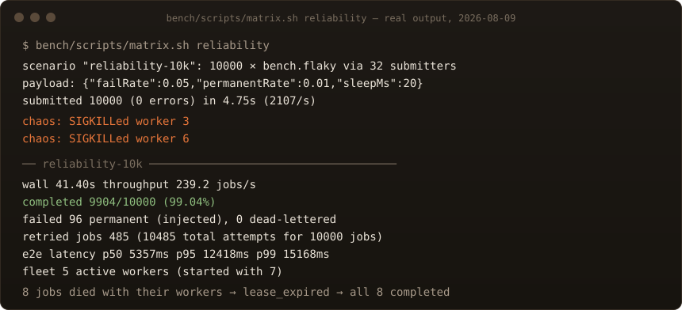
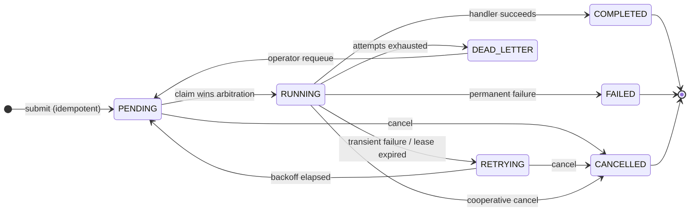
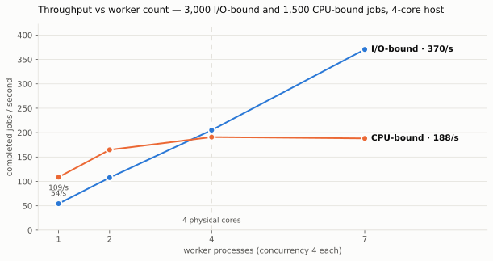
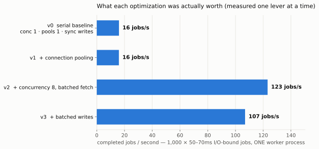
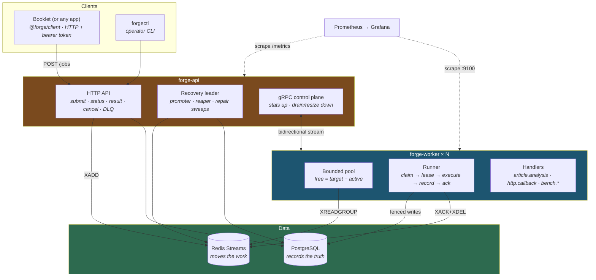

<div align="center">
  
</div>

<div align="center">

**A distributed job-processing platform that assumes workers die.**

Submit background jobs over HTTP. Forge queues them durably, runs them
across a fleet of Go workers, retries what fails, recovers what crashes —
and proves all of it with committed benchmarks, including the run where
two workers get `kill -9` mid-job.

</div>

<div align="center">


</div>

---

<div align="center">
  
</div>

---

## The problem

Every web application accumulates work that shouldn't happen on a request:
article extraction that takes fifteen seconds, embeddings that take CPU,
webhooks that need retries, feeds that need a schedule. The usual first
answers are all traps —

- **Do it on the request** and the user watches a spinner pay for it.
- **`go func()` / fire-and-forget** and a restart silently loses work; the
  recovery plan is a human remembering a backfill script.
- **A queue without a record** and "what happened to job X yesterday" has
  no answer.
- **A queue that trusts workers** and the first `kill -9` — a deploy, an
  OOM, a node dying — strands a job in `RUNNING` forever, which is the
  worst failure a job system has, because no error ever fires.

Forge is the missing tier, built the way the failure modes demand:
**Redis Streams move the work, Postgres records the truth, and Go runs
it** — with every seam between those three designed around the question
*"and what if it dies right here?"*

## What makes it different

### Jobs survive `kill -9` — and there's a test that proves it

Every claim is held by a **lease** renewed while work genuinely runs. A
worker that dies stops renewing; the reaper reclaims its jobs off the
consumer group's own idle clock and reruns them elsewhere. A worker that
was merely *stalled* and wakes up after losing its job? Its late write
bounces off a **fencing token** — the job may run twice, its result is
written exactly once.

This isn't a diagram claim. The integration suite **starts a real worker
process, waits until it's provably mid-job, SIGKILLs it**, and asserts
the job completes elsewhere with the whole story in the attempt history:

```
attempt 1   lease_expired   doomed-worker    "lease expired: worker presumed dead"
attempt 2   completed       healthy-worker
```

That test runs in CI on every push.

### An explicit state machine — illegal transitions are tested errors



Every `(from, to)` pair — all 49 — is table-tested, the illegal ones as
thoroughly as the legal ones. The database enforces it a second time:
every transition is a conditional `UPDATE`, and zero rows affected means
*someone else got there first*, which is a return value here, not an error.

### Backpressure without buffers

The worker pool computes `free = target − active` before every fetch and
never claims more than that. No internal buffer channel exists, so backlog
**cannot hide inside a process** — it stays in Redis, where it's visible
(queue depth), durable, and claimable by whoever has capacity. The
concurrency bound and the backpressure story are one mechanism, about
forty lines of Go.

### Retries that don't stampede

Full-jitter exponential backoff — `uniform(0, min(cap, base·2ⁿ))` — so 500
jobs failing against one downed dependency retry *decorrelated* instead of
in synchronized waves. Handlers classify their own failures: transient
errors retry, `NonRetryable` ones fail fast (retrying a 400 five times is
just five 400s), and exhausted jobs park in a **dead-letter queue** with
their full attempt history, one `forgectl requeue` away from another
chance.

### Honest guarantees, in writing

Forge delivers **at-least-once execution with exactly-once result
persistence**. It does not claim exactly-once execution — no queue can
from the outside, and the docs say so. What it does guarantee: submission
with an idempotency key never creates duplicate jobs (a retried submit
returns the *original*), every job reaches a terminal state or is visibly
stuck where an operator can see it, and no job silently disappears — with
three repair sweeps closing the crash windows between Postgres and Redis
writes.

### Watch it work

`docker compose up` includes Prometheus and a provisioned Grafana
dashboard whose layout is the mental model — *how much work, who's doing
it, how well is it going* — including the panel that plots **e2e p95
against execution p95**: the distance between those lines is time spent
waiting, which is backpressure drawn as two lines.

A gRPC **control plane** streams live worker stats up and pushes
`drain / pause / resume / set-concurrency` down with no polling delay,
driven from a CLI:

```
$ forgectl live                          # connected workers, live stats
$ forgectl concurrency worker-3 8        # live-resize a pool
$ forgectl drain worker-3                # graceful shutdown, now
$ forgectl dlq && forgectl requeue <id>  # inspect and revive dead letters
```

## The numbers

Seventeen benchmark runs are committed with full provenance (host, kernel,
fleet shape, git SHA, complete config) in [`bench/results/`](bench/results/),
produced by a harness that **refuses dirty starts, ends only when every
job is terminal, and rounds its own wall clock against itself**. Full
methodology and findings: [`bench/BENCHMARKS.md`](bench/BENCHMARKS.md).

<picture>
  <source media="(prefers-color-scheme: dark)" srcset=".github/assets/bench-sweep-dark.svg">
  
</picture>

**I/O-bound work scales 6.8× across 7 workers** (54 → 370 jobs/s, 97%
efficiency). **CPU-bound work saturates at core count and then
regresses** — from 4 to 7 workers, throughput fell 1.4% while per-job
execution time rose 78%. Publishing that turnover is the point: a
benchmark that only shows the rising half of the curve is an
advertisement.

<picture>
  <source media="(prefers-color-scheme: dark)" srcset=".github/assets/bench-ablation-dark.svg">
  
</picture>

The optimizations were measured **one lever at a time**, and the results
refuse to flatter: connection pooling alone bought **0%** (a pool serving
a serial consumer is capacity nothing uses — pooling *enables*
concurrency, it isn't an optimization by itself); goroutine concurrency
bought **+670%**; write batching *cost* 13% at low write rates and was
neutral at the measured **~1,280 jobs/s single-host ceiling**. The honest
verdict on batching — "measure yours" — is in the report.

And the reliability run in the terminal above: **10,000 jobs, 5%
transient + 1% permanent injected failures, two workers SIGKILLed
mid-run — 99.04% completed, 0 lost, all 10,000 terminal**, and the 8 jobs
that died with their workers all show `lease_expired → completed` in
their attempt history. The exec p99 of 11s *is* the crash-recovery
latency, visible and tunable (`FORGE_LEASE_TTL`), not mysterious.

## Architecture



The whole design in three sentences: **Redis moves the work** (consumer
groups give per-message acks; the pending-entries list *is* the in-flight
set; `XAUTOCLAIM` *is* the visibility timeout — the crashed-worker answer
is built into the data type). **Postgres records the truth** (every job,
attempt, and transition, queryable forever, and what recovery reconciles
against). **gRPC carries only control** (jobs never travel there).

### The life of one job

```mermaid
sequenceDiagram
    participant B as Booklet
    participant A as forge-api
    participant R as Redis
    participant W as Worker
    participant P as Postgres

    B->>A: POST /jobs {type, payload, idempotencyKey}
    A->>P: INSERT (dedupe on key — replay returns the original)
    A->>R: XADD envelope (payload travels with it)
    A-->>B: 201 {id} — durable; delivery is Forge's problem now
    W->>R: XREADGROUP (≤ free slots)
    W->>P: claim: conditional UPDATE, epoch++ (arbitration)
    loop while running
        W->>R: XCLAIM JUSTID (renew idle clock)
        W->>P: extend lease (fenced)
    end
    W->>W: execute handler (panic-contained)
    W->>P: record result — fenced on epoch, durable FIRST
    W->>R: XACK + XDEL — ack SECOND, always
    B->>A: GET /jobs/:id/result → 200 {result}
```

The one ordering rule everything hangs on: **durable record first, ack
second.** A crash between them re-runs the job — which at-least-once
already promises — while the reverse order would lose it.

### Why these tools

| Choice | The reason, not the buzzword |
|---|---|
| **Go** | The concurrency story *is* the system: goroutines + channels + `context` make the bounded pool, cooperative cancel, and graceful drain ~200 straightforward lines. Measured: +670% from concurrency alone. Static binaries → 15MB `FROM scratch` images |
| **Redis Streams** | Consumer groups already implement the hard parts (PEL = in-flight set, `XAUTOCLAIM` = visibility timeout). Kafka is an ordered replayable log — wrong shape for per-message retry. RabbitMQ would fit; Redis wins because the app this serves already runs Redis — zero new infrastructure |
| **PostgreSQL** | A queue is a terrible system of record. Attempt history, DLQ queries, exact percentiles — SQL questions. Conditional UPDATEs arbitrate races; `lease_epoch` fences zombies |
| **gRPC** | Confined to the control plane, where bidirectional streaming genuinely earns it: "drain now" pushes instantly instead of waiting out a poll. Jobs never travel here |
| **Prometheus + Grafana** | Pull-based scraping matches an ephemeral fleet (compose DNS discovers every `--scale worker=7` replica automatically); histograms make the queue-wait gap plottable |

## Booklet integration

Forge was built as the async tier for [Booklet](https://github.com/jguapp/Booklet),
whose own source comments document four gaps: extraction blocking the
save request, embedding indexing as fire-and-forget, webhook delivery
with no retry, and no scheduler. The mapping from each gap to a Forge
pattern — with working receiver code and HMAC signature verification —
is in [`docs/INTEGRATION.md`](docs/INTEGRATION.md), and the
dependency-free TypeScript client lives in [`clients/ts`](clients/ts).
The boundary rule: **Booklet talks to Forge only through the HTTP API** —
no shared database, no shared Redis, either side replaceable without the
other noticing.

## Status

| | |
|---|---|
| **Core** | 4 services in 2 binaries + 2 CLIs · 16 internal packages · ~7,500 lines of Go |
| **Tests** | Unit + integration suites against real Postgres 16 & Redis 7, including a real-process SIGKILL crash-recovery test — all in CI on every push |
| **Benchmarks** | 17 committed runs with embedded provenance; findings including the unflattering ones |
| **History** | Built issue-by-issue — every subsystem has an issue stating the problem and a PR recording what was found, including the bugs |
| **Docs** | [`TECHNICAL_DOCUMENTATION.html`](docs/TECHNICAL_DOCUMENTATION.html) — the long-form guide: how it works, what went wrong, and what was learned |

## Project structure

```
cmd/
  forge-api/       HTTP API + recovery leader + gRPC control plane
  forge-worker/    the fleet: pool, runner, handlers, metrics
  forge-bench/     the load generator with honesty properties
  forgectl/        operator CLI
internal/
  job/             the domain: record, state machine, error taxonomy
  store/           Postgres: fenced writes, batched recording, migrations
  queue/           Redis Streams: priorities, delayed set, DLQ, leases
  worker/          bounded pool + runner (claim→execute→record→ack)
  recovery/        reaper, promoter, repair sweeps (leader-elected)
  handler/s        registry + article.analysis, http.callback, bench.*
  api/ control/ scale/ metrics/ retry/ config/
deploy/            Dockerfile (scratch images), compose, k8s, Grafana
bench/             harness, matrix scripts, committed results, report
clients/ts/        @forge/client for Booklet (fetch + node:crypto only)
```

## Getting started

**Everything at once** (API, workers, Postgres, Redis, Prometheus,
Grafana):

```bash
cp .env.example .env          # set FORGE_API_TOKENS (openssl rand -hex 24)
docker compose up --build
docker compose up -d --scale worker=7    # the fleet from the benchmarks

curl -X POST localhost:8080/api/v1/jobs \
  -H "Authorization: Bearer $TOKEN" \
  -d '{"type":"article.analysis","payload":{"articleId":"1","text":"…"}}'
curl localhost:8080/api/v1/jobs/<id>/result -H "Authorization: Bearer $TOKEN"
```

Grafana: `localhost:3001` · Prometheus: `localhost:9091` · API: `:8080` ·
control plane: `:9090`.

**Native** (Go 1.25, a Postgres, a Redis):

```bash
make build && make test           # unit; add test-integration with services up
FORGE_API_TOKENS=dev ./bin/forge-api &
./bin/forge-worker &
./bin/forgectl -token dev stats
```

**Reproduce the benchmarks**: `bench/scripts/matrix.sh sweep-io | sweep-cpu | ablation | reliability`
— results land in `bench/results/` with your machine's provenance
embedded. If your numbers differ from the committed ones, that's the
provenance working.

## License

MIT © 2026 Joel Vasquez
